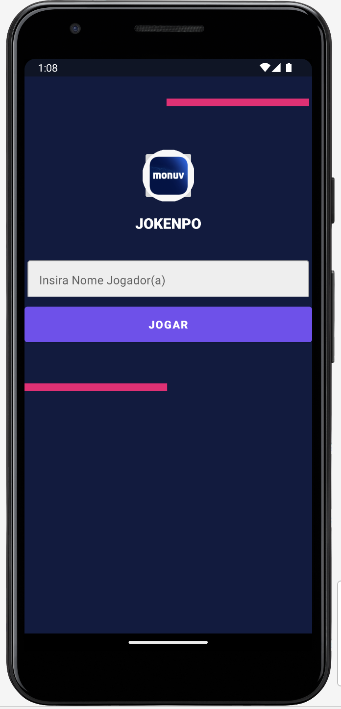
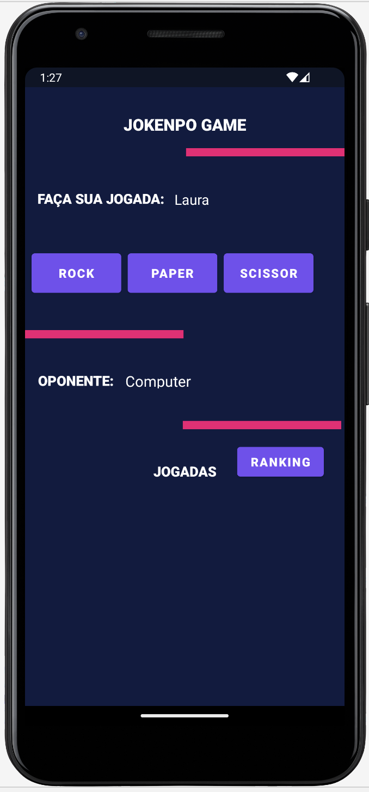
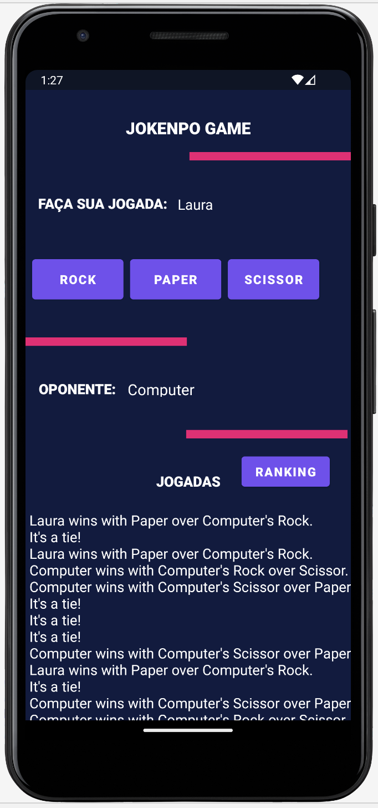
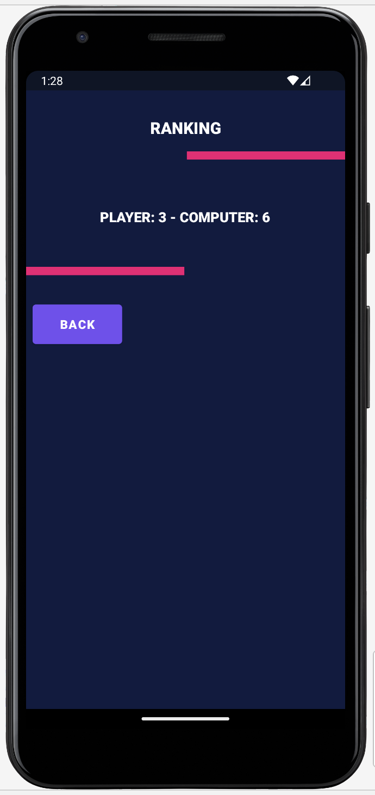

# ✊🖐️✌️ Jokenpo App – Android & Kotlin

  

---

An intuitive and lightweight Android app that brings the classic **rock, paper, scissors game** (Jokenpo) to life on mobile devices.

Built natively with **Kotlin**, following **MVC architecture** and designed to deliver a clean, responsive and modern user experience.

---

## ✨ **Features**
- Classic Jokenpo game: rock 🪨, paper 📄, scissors ✂️
- Responsive UI built with **ConstraintLayout**
- Smooth animations and interactions
- Clear separation of concerns with **MVC**
- Clean and modern Material Design
- Lightweight and fast

---

## 🛠 **Tech Stack & Architecture**
- **Android SDK**
- **Kotlin** – modern, concise and safe language
- **MVC (Model–View–Controller)** – organized and maintainable code
- **Material Design** – modern UI components
- **XML Layouts & ConstraintLayout** – flexible and responsive design
- **Gradle** build system

---

## 🎨 **UI & UX**
- Built on **Material Design** principles
- Simple, modern and intuitive interface
- Smooth user flow and feedback
- Adaptable to different screen sizes

---

## ✅ **Testing & Quality**
- Manual testing on different devices and emulators
- Focus on usability and stability

---

## 💻 **Tools & Environment**
- Android Studio
- Git & GitHub for version control
- Agile approach (Kanban) for project tracking

---

## 🌍 **Why this Project Matters?**
This Jokenpo App was created not only as a portfolio project, but to **demonstrate key Android development skills** expected by international teams:

- ✅ Building native Android apps using Kotlin
- 📦 Applying architectural patterns (**MVC**) for maintainability
- 🎨 Delivering modern UI aligned with Material Design
- ⚡ Creating lightweight and efficient apps with clean code
- 📱 Focusing on responsive layouts and smooth interactions

It shows readiness to deliver **simple yet complete apps**, focusing on quality, user experience and maintainable architecture.

---

### ✅ Status: Completed ✔️

---

## 📱 Screenshots

  
  
  
  

---

## 💡 Interested in building your own app?
📩 Message me or 👉 [**Connect on LinkedIn**](https://www.linkedin.com/in/laura-oliveira-mobile/)

📩 laura.oliveira.tech@gmail.com

Let’s create modern, robust and user-friendly Android apps together!

---

> ⭐ *Thank you for visiting! Let’s build something impactful together!*
